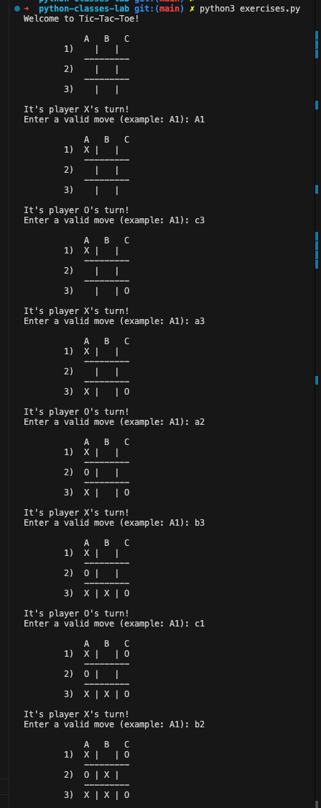
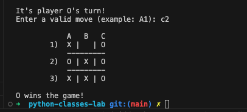

# Python Classes Lab
### Exercise Introduction

In this lab, you can practice object-oriented programming (OOP) by building a Tic-tac-toe terminal game with Python Classes.

While working through this lab, consider the gameplay of Tic-Tac-Toe and, if necessary, pseudocode it. Try to write several small functions, each performing a single purpose, e.g., print_board, get_move, check_for_winner, etc. Consider how/where looping makes sense, e.g., loop until the player enters a correct move or until the game’s over, etc.

### User Stories
Your goal is to implement the following user stores:

- As a user (AAU), I want to see a welcome message at the start of a game.
- AAU, before being prompted for a move, I want to see the board printed in the console to know what moves have been made.
- AAU, at the beginning of each turn, told whose turn it is: It’s player X’s turn!
- AAU, I should be prompted to enter a move and be provided an example of valid input ('Enter a valid move (example: A1)').
- AAU, I want to be able to enter my move’s column letter in upper or lower case (a/A, b/B, or c/C) to make it easier to enter my move.
- AAU, if I enter a move in an invalid format or try to occupy a cell already taken, I want to see a message chastising me and be re-prompted.
- AAU, after entering a move, I should once again be presented with the updated game board, notified of the current turn, and asked to enter a move for the other player. This process should continue until there is a winner or a tie
- AAU, I should see a message at the end of the game indicating the winner or stating that the game ended in a tie.

### After Completing Python Classes Lab, this is what occurred after running python3 exercises.py

  
  